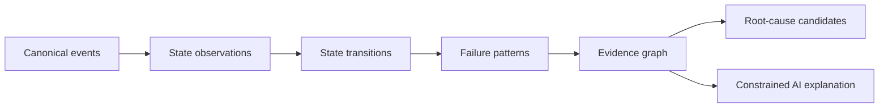

# MVP Architecture and Post-MVP Proposals

> Status: design proposal. DBSleuth is still in feasibility validation; the pipeline and repository paths below describe the target architecture, not released functionality.

## Recommended stack

- Language: Go
- CLI: Cobra or standard `flag` package
- Templates: Go `html/template` and `text/template`
- Internal interchange: versioned JSON schema
- Packaging: GoReleaser
- CI: GitHub Actions on Windows, Linux, and macOS
- Tests: fixture-driven golden tests plus fuzzing for parsers and archive handling

Go is recommended for single-file distribution, streaming file processing, predictable deployment, and straightforward cross-platform releases.

## Processing pipeline

```text
Input files/archive
  -> safe archive extraction
  -> file inventory and type/encoding detection
  -> source-specific streaming parsers
  -> canonical events
  -> timestamp/timezone normalization
  -> severity/category rules
  -> fingerprinting and duplicate grouping
  -> bounded temporal correlation
  -> state recognition and observations
  -> state transitions and failure patterns
  -> redaction candidate scan
  -> evidence index
  -> JSON/Markdown/HTML renderers
```

## Canonical event schema

```json
{
  "schema_version": "1.0",
  "event_id": "sha256:...",
  "source": {
    "path": "alert_ORCL.log",
    "parser": "oracle-alert-text",
    "parser_version": "0.1.0",
    "line_start": 1204,
    "line_end": 1208
  },
  "time": {
    "original": "2026-08-12T01:44:21.123+08:00",
    "normalized_utc": "2026-08-11T17:44:21.123Z",
    "timezone_source": "embedded",
    "confidence": 1.0
  },
  "entity_id": "db:orcl1",
  "system": "oracle",
  "component": "rdbms",
  "severity": "high",
  "category": "instance/storage",
  "codes": ["ORA-00240"],
  "summary": "Control file enqueue held for an extended period",
  "raw": "...",
  "fingerprint": "...",
  "attributes": {},
  "rule_ids": ["ORA-00240"],
  "confidence": 0.98
}
```

## Post-MVP state intelligence proposal

This layer is not part of the current Oracle/Linux parsing MVP. It may be implemented only after the canonical event and evidence model is validated against real anonymized fixtures.

The state layer is a deterministic, replayable projection over canonical events. It reduces long-term analysis volume without replacing the evidence from which it was derived.



Core invariants:

- every state observation references at least one canonical event;
- every canonical event retains an exact source span and parser version;
- missing data produces `unknown`, not a normal state;
- inferred baselines are marked explicitly;
- a pattern emits a root-cause candidate, not an unqualified causal claim;
- rule versions and input hashes make results replayable and idempotent;
- AI may explain cited facts but cannot create states or modify deterministic scores.

State codes are partitioned by entity domain: `1xxx` host, `2xxx` process, `3xxx` thread, `4xxx` memory, `5xxx` database, `6xxx` network, `7xxx` storage, `8xxx` application, and `9xxx` incident. The full dictionary, transition model, anti-flapping rules, and quality gates are defined in [docs/STATE_ENGINE.md](docs/STATE_ENGINE.md).

## Data retention model

| Level | Data | Purpose |
|---|---|---|
| 1 | state observations, transitions, pattern hits | long-term timeline and compact AI context |
| 2 | canonical events and incident-window metrics | incident analysis and replay |
| 3 | original logs, traces, dumps, and attachments | evidence review and deep analysis |

Formal reports must be navigable from Level 1 to Level 2 and then to the immutable Level 3 source evidence.

## Optional Post-MVP TraceMind Incident Bundle adapter

This adapter is not a runtime dependency and is not part of the current MVP.

TraceMind integration is an optional planned input adapter. It accepts sanitized, versioned events, metric windows, state observations, topology, AWR/APM evidence, and selected attachments. It must not import platform credentials, database connection settings, private keys, or TraceMind's application database.

DBSleuth remains independently useful for local Oracle/Linux logs and never reconnects to addresses found in an exported bundle. The interface and security boundary are defined in [docs/TRACEMIND_INTEGRATION.md](docs/TRACEMIND_INTEGRATION.md).

## Safety requirements

- Reject archive entries with absolute paths or path traversal.
- Enforce configurable limits on expanded size, file count, nesting, and compression ratio.
- Stream large files instead of reading bundles fully into memory.
- Never modify the source bundle.
- Escape all log content in HTML output.
- Do not execute content found in logs.
- Mark guessed encodings and user-supplied timezones in the report.
- Preserve unknown lines around detected events as evidence context.
- Redact exported copies, not original inputs.

## Correlation boundary

MVP correlation is temporal and rule-based:

- show events in a configurable window around a critical event;
- identify ordering and time distance;
- group events sharing codes, normalized templates, identifiers, or components;
- use language such as “preceded”, “followed”, and “co-occurred”.

The MVP must not claim “root cause” unless a deterministic rule has explicit, documented preconditions. Even then, output should say “root-cause candidate” with confidence and evidence.

## Repository layout

```text
cmd/dbsleuth/            CLI entry point
internal/archive/        safe archive inspection
internal/detect/         type and encoding detection
internal/event/          canonical schema
internal/parser/oracle/  Oracle alert parser
internal/parser/linux/   syslog/journal text parser
internal/rules/          deterministic classifications
internal/correlate/      grouping and time-window logic
internal/state/          planned state recognition and transitions
internal/pattern/        planned failure-pattern matching
internal/integration/    planned versioned bundle adapters
internal/redact/         candidate detection and transforms
internal/report/         JSON, Markdown, HTML rendering
fixtures/                anonymized regression corpus
schemas/                 published JSON schemas
docs/                    user and contributor documentation
```

See [docs/CASE_DEMO_STORAGE_INCIDENT.md](docs/CASE_DEMO_STORAGE_INCIDENT.md) for a complete illustrated walkthrough from storage evidence to an Oracle incident report.
