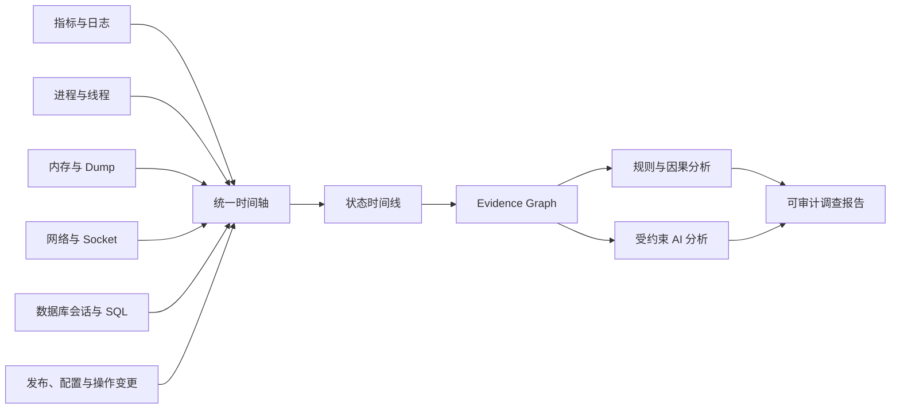
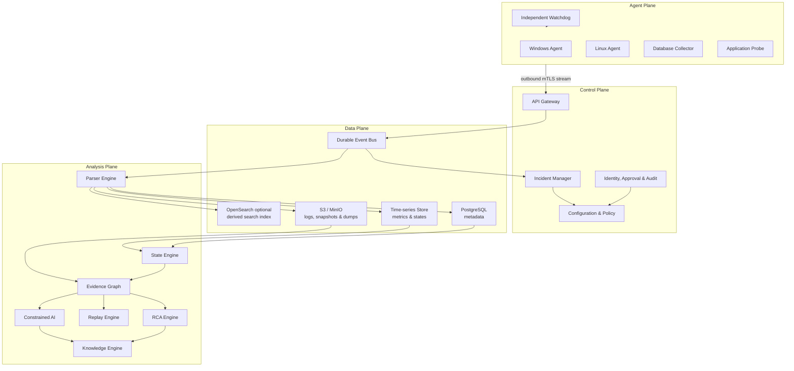
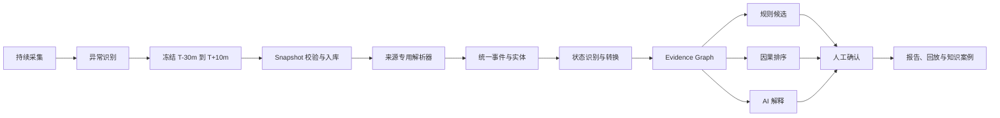

<div align="center">

# DBSleuth · 库迹

### 企业级故障黑匣子、事故调查与 AI 根因分析平台

**库有迹，障可循；现场可还原，结论可复核。**

DBSleuth 持续记录系统状态，在故障窗口冻结日志、指标、线程、内存、进程、网络、数据库和变更证据，
重建跨层故障演化过程，让工程师和 AI 面对的是一份可验证的“事故现场”，而不是零散告警。

[](LICENSE)
[](#当前阶段)
[](#安全与数据边界)
[](#证据优先)
[](docs/STATE_ENGINE.md)

[产品定位](#产品定位) · [核心能力](#核心能力) · [现场重建](#事故现场重建) · [总体架构](#总体架构) · [路线图](#实施路线) · [English](README_EN.md)

</div>

---

> [!IMPORTANT]
> DBSleuth 当前处于架构设计与可行性验证阶段，尚未发布可用于生产环境的正式版本。本文描述的是产品目标、架构边界和计划中的交付能力；示例命令及界面并不表示相关功能已经完成。

## 产品定位

DBSleuth 不是另一个监控大盘，也不是把日志直接交给大模型总结的聊天工具。它面向生产故障调查，解决三个核心问题：

1. **故障发生前后，系统真实经历了什么？**
2. **主机、进程、线程、网络、数据库和业务之间如何相互影响？**
3. **每个判断能否回到原始证据，并说明缺失信息与反证？**

```text
传统方式
告警 → 人工登录多台服务器 → 临时执行命令 → 拼接日志 → 猜测根因

DBSleuth
持续记录 → 异常触发 → 冻结现场 → 统一证据 → 重建状态 → 候选根因 → 人工确认
```

最终目标不是只回答“CPU 高了”或“数据库慢了”，而是重建完整的故障链：

```text
10:02:13  存储延迟升高
10:02:20  数据库 IO 等待进入异常状态
10:02:25  业务线程由运行转为数据库等待
10:02:30  请求超时并触发事故快照

根因候选：存储路径异常
置信度：0.93
支持证据：8 项
反证：2 项
限制：缺少 SAN 交换机日志，尚不能最终确认
```

## 核心能力

| 能力 | DBSleuth 的设计 |
|---|---|
| 持续黑匣子 | 低开销保存状态、关键指标和事件环形缓冲区 |
| 事故快照 | 按策略冻结故障前后窗口，生成不可变 Snapshot |
| 内存快照 | 从内存摘要、对象分布到受审批的完整 Dump 分级采集 |
| 线程追踪 | 连续采样线程状态、调用栈、锁、IO、网络和数据库等待 |
| 受控动态探针 | 在运行时临时打印方法耗时、异常和脱敏变量，无需永久改代码 |
| 数据库现场 | 关联会话、SQL 指纹、执行计划、等待、锁、事务和复制状态 |
| 状态智能 | 把离散指标与事件转换为状态、状态转换和故障模式 |
| 证据图谱 | 连接请求、线程、进程、Socket、会话、SQL、存储和变更 |
| 根因分析 | 规则、因果图和 AI 分层分析，同时保留反证与不确定性 |
| 故障回放 | 按统一时间轴重放故障传播过程，支持规则和模型复验 |
| 知识沉淀 | 将确认根因、处置步骤和适用条件转化为可版本化案例 |
| 安全审计 | 采集、查看、下载、解密、探针和导出操作全部留痕 |

## 事故现场重建

监控指标只能说明“数值变了”，无法完整回答当时哪个线程在等待、哪个对象持续增长、哪条 SQL 占用连接、哪次发布改变了行为。DBSleuth 计划通过多层现场数据，把故障窗口还原成可调查、可回放的 Scene Context Pack。



### 内存快照

内存采集采用分级策略，避免为了诊断而制造新的生产事故：

| 级别 | 内容 | 默认策略 |
|---|---|---|
| L1 摘要 | RSS、虚拟内存、Swap、堆使用率、GC、分配速率 | 可持续采集 |
| L2 结构化快照 | 对象直方图、内存映射、池使用率、增长热点 | 异常触发，限频 |
| L3 原始快照 | Core Dump、Heap Dump、进程完整转储 | 明确审批、限时、加密 |

L3 数据可能包含业务明文、密钥或用户信息，不能默认采集，也不能未经脱敏直接进入 AI 上下文。分析服务优先从结构化摘要中提取事实，只有证据不足时才申请更高等级快照。

### 连续线程追踪

线程追踪不是事故发生后才执行一次 `jstack`。Agent 以低频采样保存线程状态与调用栈指纹，在异常窗口提升采样密度，从而保留状态变化：

```text
RUNNABLE
  ↓ 32 ms
WAIT_NETWORK
  ↓ 29.8 s
DB_CONNECTION_TIMEOUT
```

每个线程样本计划关联：

- `host_id`、`process_id`、线程 ID 与线程名称；
- 单调时钟和墙上时钟，避免时钟漂移破坏顺序；
- 调用栈指纹、锁拥有者与等待者；
- Socket 五元组、Trace/Span、数据库会话和 SQL 指纹；
- 采样率、丢失数量、采集器版本和数据完整度。

这让系统能够判断线程是在消耗 CPU、等待锁、等待磁盘、等待网络，还是被下游数据库阻塞，而不是只看到“线程数很多”。

### 受控动态探针

动态打印用于补齐现有日志没有记录的关键事实，例如方法耗时、异常类型、返回状态或经过脱敏的变量。它不是远程执行任意代码的入口。

生产约束包括：

- 只允许命中预先批准的方法、事件和字段白名单；
- 策略必须签名，并带审批人、原因、TTL 和目标范围；
- 强制采样率、速率、输出大小和并发上限；
- 密码、Token、Cookie、身份证号和业务敏感字段在 Agent 端脱敏；
- 到期自动卸载，安装、命中、变更和卸载全程审计；
- 不支持任意表达式、任意脚本和无边界对象遍历；
- 超过 CPU、内存或延迟预算时自动熔断。

### 数据库现场

数据库证据与操作系统现场使用同一时间轴和实体标识，目标支持：

- Oracle：会话、等待事件、阻塞链、SQL ID、执行计划、AWR/ASH、RAC/ADG；
- MySQL：线程、锁等待、事务、Performance Schema、主从复制与 MGR；
- PostgreSQL：会话、等待事件、锁、慢 SQL、流复制与 WAL；
- SQL Server：请求、等待、阻塞、执行计划、Always On 与 Extended Events。

查询失败、权限不足或连接中断必须记录为证据缺口，不能把“没有采集到”解释成“系统正常”。

### Scene Context Pack

一次事故的现场包计划包含：

```text
incident-bundle/
├── manifest.json              # 版本、时间窗、哈希、完整度和数据等级
├── timeline/                  # 标准事件、状态观察与状态转换
├── host/                      # CPU、内存、磁盘、网络和内核证据
├── process/                   # 进程树、资源、文件句柄和 Socket
├── threads/                   # 连续线程轨迹、调用栈和锁关系
├── memory/                    # 内存摘要、直方图与授权后的 Dump
├── database/                  # 会话、等待、SQL 指纹、计划和复制状态
├── probes/                    # 动态探针策略、命中结果和审计记录
├── changes/                   # 发布、配置、脚本和人工操作变更
├── evidence/                  # 证据索引与引用关系
└── checksums.sha256           # 完整性校验
```

AI 只接收经过授权、结构化、带来源引用的上下文。每条输出结论都必须附带证据、反证、置信度和限制，使其像进入事故现场一样理解系统，但不能越过事实边界自行补全缺失信息。

## 总体架构



### 四个平面

| 平面 | 责任 | 不负责 |
|---|---|---|
| Agent Plane | 低开销采集、缓冲、快照、脱敏、自保护 | 根因判断和任意远程执行 |
| Control Plane | 事故、配置、策略、身份、审批、审计 | 保存大体积原始证据 |
| Data Plane | 元数据、时序、对象、事件流和派生搜索 | 修改原始证据 |
| Analysis Plane | 解析、状态、证据图、RCA、回放和知识 | 绕过证据直接生成结论 |

### Agent 生存能力

事故最严重时，采集端本身也可能失去网络、磁盘或进程资源。Agent 的设计优先级是“活下来并保住最后现场”：

- Agent 主动建立出站 mTLS 连接，不在业务主机暴露入站管理端口；
- 关键事件进入本地持久化队列，断网后可续传并保持幂等；
- 指标和线程轨迹使用有界环形缓冲区，磁盘压力时按等级淘汰；
- 独立 Watchdog 监控主进程并写入 Last Will；
- CPU、内存、磁盘、采样频率和上传带宽均有硬预算；
- 配置版本化，失败自动回滚到最近有效版本；
- 最小权限运行，高权限采集器按任务、目标和有效期临时授权。

## 调查流水线



调查过程必须区分：

- **Fact**：原始证据直接支持的事实；
- **Derived Fact**：由确定性解析或计算得到的事实；
- **Hypothesis**：尚待验证的根因候选；
- **Confirmed Root Cause**：经过人工确认并记录依据的根因。

## 状态智能

DBSleuth 不只保存指标值，还计划保存实体状态和状态转换，让长时间运行历史可以被压缩、检索和重放。

| 编码 | 实体域 | 示例 |
|---:|---|---|
| `1xxx` | 主机 | CPU、内存、内核故障 |
| `2xxx` | 进程 | 高 CPU、内存增长、线程泄漏、崩溃 |
| `3xxx` | 线程 | 锁、IO、网络等待与死锁 |
| `4xxx` | 内存 | 压力、Swap、泄漏、OOM 风险 |
| `5xxx` | 数据库 | IO、日志、锁、内存与挂起 |
| `6xxx` | 网络 | 链路、丢包、连接与 DNS 异常 |
| `7xxx` | 存储 | 延迟、队列、路径与介质故障 |
| `8xxx` | 应用 | 错误率、超时与业务失败 |
| `9xxx` | 事故 | 影响范围和重大故障 |

状态不是证据。每个状态必须引用标准事件，每个标准事件必须回到原始文件、准确位置、采集器和规则版本。未知、采集失败和规则未覆盖必须显示为 `unknown`，不能算作健康。详细设计见 [docs/STATE_ENGINE.md](docs/STATE_ENGINE.md)。

## 证据优先

> **Evidence before explanation.**

- 确定性解析优先于概率推断；
- 不编造缺失的时间、字段、事件或因果关系；
- 时间邻近只代表相关性，除非还有拓扑、机制和排他证据；
- 每项结论必须引用来源、时间、实体、哈希和解析器版本；
- 支持证据与反证同时进入证据图和最终报告；
- AI 只能解释、排序和提出下一步验证建议，不能修改确定性事实；
- 连接失败、权限不足、快照不完整和解析失败必须显式降级；
- 只有人工确认后，根因候选才能转为已确认根因。

## 数据分层与保留

| 层级 | 数据 | 保留目的 |
|---|---|---|
| Level 1 | 状态、转换、模式和结论索引 | 长期趋势、检索和轻量 AI 上下文 |
| Level 2 | 标准事件、关键指标、线程指纹和数据库摘要 | 事故窗口分析与规则重放 |
| Level 3 | 日志、Trace、配置差异和结构化快照 | 证据复核与深度诊断 |
| Level 4 | Dump、敏感变量、完整 SQL 文本等受限数据 | 经审批的专项调查 |

元数据计划存入 PostgreSQL，指标和状态进入时序数据库，大文件进入 S3/MinIO。OpenSearch 仅作为可重建的派生搜索索引，不作为事实源。所有数据都带租户、环境、资产、事故、时间窗、等级、保留策略和校验哈希。

## 安全与数据边界

- 默认本地优先，可部署在完全离线或隔离网络；
- Agent 只主动出站连接，服务间使用 mTLS；
- Snapshot 在传输和静态存储时加密；
- 密钥由外部 KMS、Vault 或企业密钥系统管理；
- 所有策略、探针和高风险采集任务必须签名、审批并带有效期；
- 访问采用租户、环境、资产和数据等级四层授权；
- 原始证据只追加，不原地修改，派生结果保留来源链；
- 导出前执行敏感字段扫描和脱敏预览；
- L4 数据默认不进入搜索索引、知识库或 AI 上下文；
- 不允许把通用 Shell、PowerShell、SQL 或脚本执行包装成 Agent 任务。

## 部署方式

### 小型环境

单节点或少量节点可以合并部署 API、控制、解析、状态、证据和报告模块，外接 PostgreSQL、对象存储和时序数据库。模块保持明确边界，但不强制一开始拆成大量微服务。

### 企业环境

控制服务无状态多副本部署；解析、Dump、图谱和 AI 使用隔离 Worker 池；事件总线、PostgreSQL、对象存储与时序数据库采用高可用方案。目标灾备指标：

- 元数据与策略 `RPO < 1 小时`；
- 核心控制面 `RTO < 30 分钟`；
- Agent 断网期间依靠本地缓冲继续保存关键证据；
- 对象证据跨节点或跨站点复制，并定期执行恢复演练。

## 计划输出

```text
incident-report.html          自包含、可交付的事故调查报告
incident-report.md            便于评审和版本管理的 Markdown 报告
incident-report.json          机器可读的事实、假设、结论与限制
timeline.json                 统一事件时间线
state-timeline.json           状态观察与状态转换
evidence-graph.json           实体、证据、关系与反证
scene-context-pack.zip        经授权导出的事故现场包
checksums.sha256              原始证据和派生结果完整性校验
```

## 计划中的命令行

```bash
# 安全清点故障包，不执行其中的脚本、SQL 或附件
dbsleuth inspect incident.zip

# 生成时间线、状态、证据图和调查报告
dbsleuth analyze incident.zip --timezone Asia/Shanghai

# 仅重建事故现场和数据完整度
dbsleuth reconstruct incident.zip --window-before 30m --window-after 10m

# 回放状态转换与故障传播
dbsleuth replay incident.zip --from "2026-08-12T01:40:00+08:00"

# 预览潜在敏感信息，不修改原始文件
dbsleuth redact incident.zip --preview
```

## 当前阶段

| 范围 | 状态 | 说明 |
|---|---|---|
| 产品章程与安全边界 | 已形成 | 仍会随匿名真实案例修订 |
| Oracle/Linux 离线解析 MVP | 规划中 | 首个可验证实现范围 |
| State Intelligence Engine | 设计草案 | 已定义编码、转换和证据约束 |
| Snapshot 与现场重建 | 架构设计 | 待冻结格式、协议和资源预算 |
| Agent、线程、内存与动态探针 | 规划中 | 必须先完成生产安全验证 |
| Evidence Graph 与 RCA | 规划中 | 依赖稳定的统一事件和实体模型 |
| AI 调查助手 | 规划中 | 最后接入，只消费受约束证据 |
| 企业高可用与灾备 | 规划中 | 在单节点链路验证后实施 |

## 实施路线

```text
Phase 0  统一事件、实体、状态、Snapshot 和安全契约
Phase 1  Oracle + Linux 离线解析器与可追溯报告
Phase 2  Agent、环形缓冲、事故触发和现场冻结
Phase 3  内存快照、连续线程追踪、受控动态探针和数据库现场
Phase 4  Evidence Graph、规则 RCA、回放与知识案例
Phase 5  受约束 AI、企业高可用、多租户、审计与灾备
```

每个阶段都必须使用匿名化真实故障包盲测。准确率、可追溯率、资源开销和故障注入测试不达标时，不进入下一阶段。详细 MVP 计划见 [ROADMAP.md](ROADMAP.md)。

## 质量门槛

| 指标 | 最低门槛 |
|---|---:|
| 虚构事件或错误证据位置 | `0` |
| 结论到原始证据的可追溯率 | `100%` |
| 状态到标准事件的可追溯率 | `100%` |
| Snapshot 哈希和清单一致性 | `100%` |
| 支持格式的时间戳提取率 | `>= 95%` |
| 高风险事件分类准确率 | `>= 90%` |
| 关键状态识别准确率 | `>= 90%` |
| Agent 正常模式 CPU 预算 | `<= 2%` |
| Agent 正常模式内存预算 | `<= 512 MB` |
| 未授权高等级采集 | `0` |

## 项目文档

| 文档 | 内容 |
|---|---|
| [PROJECT_CHARTER.md](PROJECT_CHARTER.md) | 产品目标、用户、原则与停止条件 |
| [ARCHITECTURE.md](ARCHITECTURE.md) | MVP 架构、事件模型和安全边界 |
| [ROADMAP.md](ROADMAP.md) | 分阶段实现路线 |
| [BACKLOG.md](BACKLOG.md) | 首批 Epic 与工程任务建议 |
| [docs/STATE_ENGINE.md](docs/STATE_ENGINE.md) | 状态编码、状态转换、故障模式与质量约束 |
| [docs/DBSLEUTH_INCIDENT_BUNDLE.md](docs/DBSLEUTH_INCIDENT_BUNDLE.md) | Agent、Collector 与分析引擎之间的事故数据契约 |
| [docs/CASE_DEMO_STORAGE_INCIDENT.md](docs/CASE_DEMO_STORAGE_INCIDENT.md) | 从存储异常到 Oracle 故障的端到端图文案例 |
| [README_EN.md](README_EN.md) | English overview |

## 参与贡献

项目当前最需要：

- 经确认完成脱敏的 Oracle、Linux、MySQL、PostgreSQL 和 SQL Server 故障样本；
- 能证明时间顺序、跨层关联和反证关系的真实事故案例；
- 内存、线程、锁、网络和数据库等待的安全采集方案；
- 可复现的解析规则、状态规则和故障模式；
- 解析器、测试、文档和跨平台发行贡献。

> [!CAUTION]
> 提交样本前，请移除密码、Token、连接串、真实 IP、主机名、数据库名、用户名、路径及业务数据。不要在公开 Issue 中上传未经人工复核的生产日志、Dump 或线程快照。

## 许可证

DBSleuth 使用 [Apache License 2.0](LICENSE) 开源。

---

<div align="center">

**DBSleuth · 记录现场，连接证据，解释故障。**

</div>
