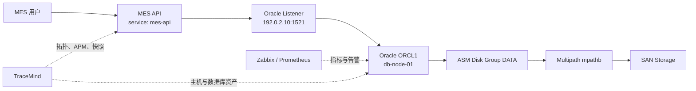
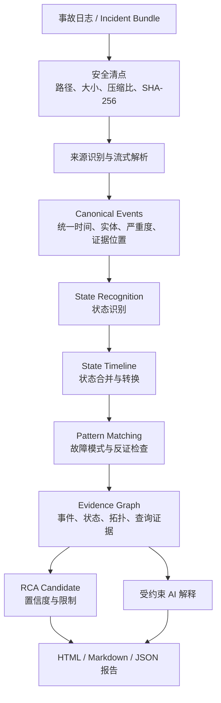
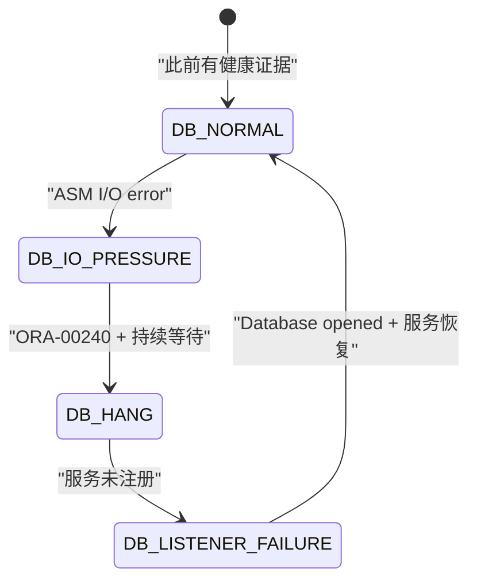
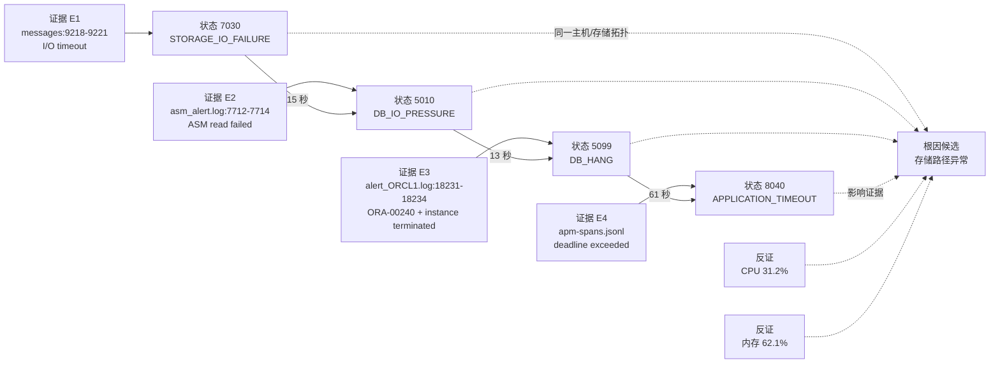
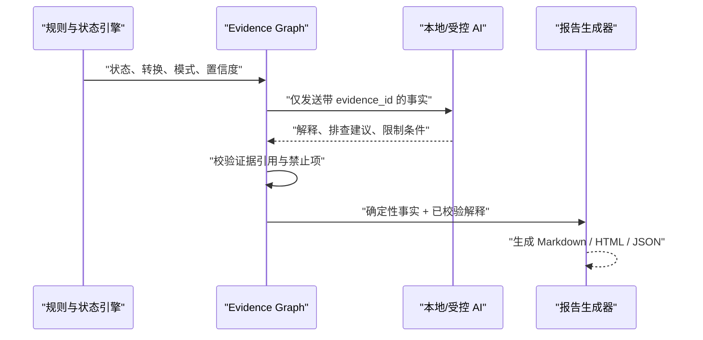
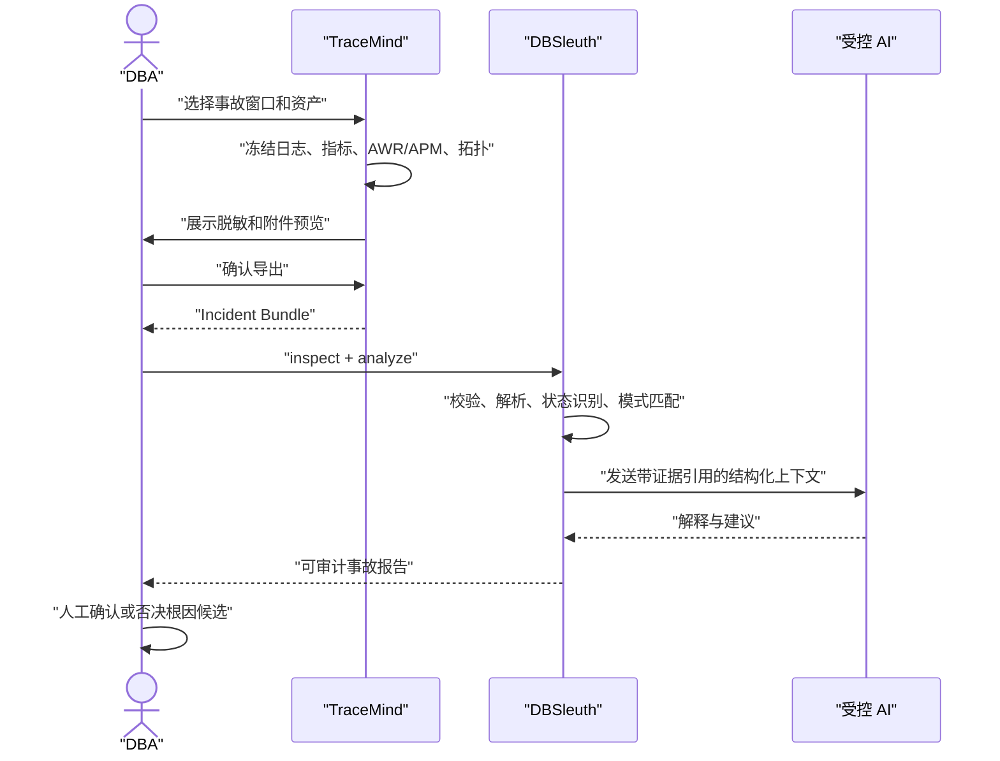

# 案例 Demo：从存储异常到 Oracle 实例故障

| 属性 | 内容 |
|---|---|
| 版本 | v0.1 Draft |
| 状态 | 产品与架构演示文档，功能待实现 |
| 场景 | TraceMind Incident Snapshot + DBSleuth 离线证据分析 |

> [!IMPORTANT]
> 本文使用完全虚构、已脱敏的数据说明目标工作流，不代表当前版本已经实现这些命令和界面。示例中的 IP 属于文档保留地址，日志内容也不对应任何真实生产系统。

## 1. Demo 目标

本案例演示 DBSleuth 如何把分散在 Linux、存储、Oracle、Listener、APM 和监控系统中的信息，转换为一条可以审计的故障演化链：

```text
存储路径超时
  -> ASM / Oracle IO 压力
  -> 控制文件等待
  -> Oracle 实例终止
  -> Listener 无可用服务
  -> MES 请求超时
```

最终输出不是一句“AI 判断存储有问题”，而是：

1. 发生了哪些事件；
2. 每个事件来自哪个文件、哪几行；
3. 哪些状态由确定性规则识别；
4. 状态之间如何转换；
5. 哪个故障模式被命中；
6. 哪些证据支持或反驳根因候选；
7. AI 使用了哪些结构化事实，结论有哪些限制。

## 2. 场景与拓扑

| 属性 | 内容 |
|---|---|
| 事故编号 | `DEMO-20260812-001` |
| 事故窗口 | `2026-08-12 01:30:00 +08:00` 至 `02:15:00 +08:00` |



| 实体 | 脱敏标识 | 关键属性 |
|---|---|---|
| 应用 | `service:mes-api` | MES 核心 API |
| 主机 | `host:db-node-01` | Linux，`192.0.2.10` |
| 数据库 | `db:orcl1` | Oracle 19c，实例 `ORCL1` |
| 存储 | `storage:mpathb` | `/dev/mapper/mpathb`，ASM DATA |
| 监控 | `monitor:db-node-01` | Zabbix + Prometheus |

拓扑关系很重要。只有确认数据库、ASM 磁盘组和故障存储路径属于同一依赖链，系统才能提高“存储异常候选”的置信度。

## 3. 事故输入

TraceMind 在用户确认脱敏预览后导出 Incident Bundle；没有 TraceMind 时，也可以直接提供日志目录或压缩包。

```text
DEMO-20260812-001/
├── manifest.json
├── linux/
│   └── messages
├── oracle/
│   ├── alert_ORCL1.log
│   ├── asm_alert.log
│   └── listener.log
├── tracemind/
│   ├── alerts.jsonl
│   ├── apm-spans.jsonl
│   ├── asset-topology.json
│   └── metric-windows.jsonl
└── checksums.sha256
```

### 3.1 Linux 原始证据

文件：`linux/messages`

```text
9218 Aug 12 01:42:13 db-node-01 kernel: sd 8:0:0:1: [sdb] tag#73 FAILED Result: hostbyte=DID_OK driverbyte=DRIVER_TIMEOUT
9219 Aug 12 01:42:13 db-node-01 kernel: blk_update_request: I/O error, dev dm-2, sector 18439248
9220 Aug 12 01:42:14 db-node-01 multipathd: mpathb: remaining active paths: 0
9221 Aug 12 01:42:16 db-node-01 kernel: Buffer I/O error on dev dm-2, logical block 2304906
```

### 3.2 ASM 原始证据

文件：`oracle/asm_alert.log`

```text
7712 2026-08-12T01:44:08.318+08:00
7713 WARNING: I/O error on disk DATA_0001, path /dev/mapper/mpathb
7714 WARNING: Read Failed. group: 2 disk: 1 AU: 176
```

### 3.3 Oracle 原始证据

文件：`oracle/alert_ORCL1.log`

```text
18231 2026-08-12T01:44:21.006+08:00
18232 ORA-00240: control file enqueue held for more than 120 seconds
18233 2026-08-12T01:45:04.811+08:00
18234 Instance terminated by background process, pid = 20341
18235 2026-08-12T02:02:16.420+08:00
18236 Database opened.
```

### 3.4 Listener 原始证据

文件：`oracle/listener.log`

```text
4412 12-AUG-2026 01:45:18 * (CONNECT_DATA=(SERVICE_NAME=ORCL)) * 12514
4413 TNS-12514: TNS:listener does not currently know of service requested in connect descriptor
```

### 3.5 TraceMind 指标与 APM 证据

文件：`tracemind/metric-windows.jsonl`

```json
{"time":"2026-08-12T01:42:00+08:00","entity_id":"storage:mpathb","metric":"disk.await_ms","value":928.4,"threshold":50,"window":"2m"}
{"time":"2026-08-12T01:42:00+08:00","entity_id":"host:db-node-01","metric":"cpu.usage_pct","value":31.2,"threshold":80,"window":"2m"}
{"time":"2026-08-12T01:42:00+08:00","entity_id":"host:db-node-01","metric":"memory.usage_pct","value":62.1,"threshold":85,"window":"2m"}
```

文件：`tracemind/apm-spans.jsonl`

```json
{"time":"2026-08-12T01:45:22+08:00","entity_id":"service:mes-api","db_entity_id":"db:orcl1","trace_id":"demo-trace-001","operation":"POST /work-order","duration_ms":30012,"status":"deadline_exceeded"}
```

CPU 和内存数据在本案例中属于反证：事故窗口内它们没有达到压力阈值，因此系统不能把“CPU 100%”或“OOM”列为高可信根因。

## 4. 端到端处理总览



## 5. 第一步：安全清点

计划命令：

```bash
dbsleuth inspect DEMO-20260812-001.zip --timezone Asia/Shanghai
```

预期输出：

```text
Bundle                 DEMO-20260812-001.zip
Files                  9
Expanded size          18.6 MB
Archive safety         PASS
Checksum verification  PASS
Detected sources       Linux, Oracle Alert, ASM, Listener, TraceMind Snapshot
Time range             2026-08-12 01:30:00 +08:00 - 02:15:00 +08:00
Unsupported files      0
Warnings               0
```

这一阶段只读取和清点输入：

- 拒绝绝对路径和目录穿越；
- 限制展开体积、文件数量、嵌套层级和压缩比；
- 记录每个文件的 SHA-256；
- 不执行附件中的 SQL、脚本或命令；
- 不尝试使用包中的地址连接生产数据库；
- 不修改原始文件。

如果压缩包校验失败，分析任务必须停止并显示失败，不能继续生成健康报告。

## 6. 第二步：标准事件

来源专用解析器把多种时间和格式转换为统一事件，但同时保留原始值和准确行号。

Linux I/O 事件示例：

```json
{
  "event_id": "sha256:linux-io-demo",
  "time": {
    "original": "Aug 12 01:42:13",
    "normalized_utc": "2026-08-11T17:42:13Z",
    "timezone_source": "user_supplied",
    "confidence": 0.95
  },
  "entity_id": "storage:mpathb",
  "system": "linux",
  "component": "block_io",
  "severity": "high",
  "category": "storage/io",
  "summary": "Multipath device reported I/O timeout",
  "source": {
    "path": "linux/messages",
    "line_start": 9218,
    "line_end": 9221,
    "parser": "linux-syslog-text",
    "parser_version": "0.1.0"
  },
  "rule_ids": ["LINUX_BLOCK_IO_ERROR", "MULTIPATH_NO_ACTIVE_PATH"]
}
```

Oracle 事件示例：

```json
{
  "event_id": "sha256:oracle-control-file-demo",
  "time": {
    "original": "2026-08-12T01:44:21.006+08:00",
    "normalized_utc": "2026-08-11T17:44:21.006Z",
    "timezone_source": "embedded",
    "confidence": 1.0
  },
  "entity_id": "db:orcl1",
  "system": "oracle",
  "component": "rdbms",
  "severity": "critical",
  "category": "instance/storage",
  "codes": ["ORA-00240"],
  "summary": "Control file enqueue exceeded the allowed wait",
  "source": {
    "path": "oracle/alert_ORCL1.log",
    "line_start": 18231,
    "line_end": 18232,
    "parser": "oracle-alert-text",
    "parser_version": "0.1.0"
  },
  "rule_ids": ["ORACLE_CONTROL_FILE_ENQUEUE"]
}
```

## 7. 第三步：状态识别

事件本身不会被丢弃。状态是对事件和指标窗口的可重放投影。

| 时间 | 实体 | 输入事实 | 识别状态 | Code | 规则 |
|---|---|---|---|---:|---|
| 01:42:13 | `storage:mpathb` | I/O timeout + active path 为 0 | 存储 IO 异常 | 7030 | `STORAGE_PATH_FAILURE` |
| 01:44:08 | `db:orcl1` | ASM disk read failed | 数据库 IO 压力 | 5010 | `ORACLE_ASM_IO_FAILURE` |
| 01:44:21 | `db:orcl1` | ORA-00240 | 数据库挂起风险 | 5099 | `ORACLE_CONTROL_FILE_ENQUEUE` |
| 01:45:18 | `db:orcl1` | TNS-12514 | Listener / 服务异常 | 5060 | `ORACLE_SERVICE_UNAVAILABLE` |
| 01:45:22 | `service:mes-api` | APM deadline exceeded | 应用超时 | 8040 | `APM_DB_TIMEOUT` |
| 02:02:16 | `db:orcl1` | Database opened | 数据库恢复 | 5000 | `ORACLE_DATABASE_OPENED` |

状态观察保留全部支持事件：

```json
{
  "observation_id": "sha256:state-db-io-demo",
  "entity_type": "database",
  "entity_id": "db:orcl1",
  "state_code": 5010,
  "state_key": "DB_IO_PRESSURE",
  "start_time": "2026-08-12T01:44:08.318+08:00",
  "end_time": "2026-08-12T01:44:21.006+08:00",
  "supporting_event_ids": [
    "sha256:asm-read-failed-demo",
    "sha256:oracle-control-file-demo"
  ],
  "rule_ids": ["ORACLE_ASM_IO_FAILURE"],
  "confidence": 0.96,
  "inferred": false
}
```

如果某段时间没有 CPU 指标，系统输出 `unknown`，不会把“没有数据”解释成 `HOST_NORMAL`。

## 8. 第四步：状态转换与防抖



```mermaid
timeline
    title DEMO-20260812-001 状态时间线
    01:42:13 : STORAGE_IO_FAILURE (7030)
    01:44:08 : DB_IO_PRESSURE (5010)
    01:44:21 : DB_HANG (5099)
    01:45:18 : DB_LISTENER_FAILURE (5060)
    01:45:22 : APPLICATION_TIMEOUT (8040)
    02:02:16 : DB_NORMAL (5000)
```

状态引擎不会在同一错误重复刷屏时不断创建新状态。相同实体和状态在合并窗口内只扩展 `end_time`、`occurrence_count` 和证据列表；状态退出还需要满足恢复条件和稳定窗口。

## 9. 第五步：故障模式与证据图

本案例命中两个计划中的模式：

| 模式 | 状态链 | 最大时间窗 | 结果 |
|---|---|---:|---|
| `storage_to_database` | 7030 -> 5010 -> 5099 | 10 分钟 | 高可信存储异常候选 |
| `database_to_application` | 5099 -> 8040 | 5 分钟 | 数据库故障影响应用候选 |



### 9.1 置信度计算示例

```text
direct_evidence       0.98 * 0.35 = 0.343
temporal_order        1.00 * 0.20 = 0.200
topology_match        1.00 * 0.20 = 0.200
rule_specificity      0.90 * 0.15 = 0.135
data_quality          0.95 * 0.10 = 0.095
contradiction_penalty              -0.040
------------------------------------------
confidence                          0.933
```

输出措辞必须是：

> 高可信根因候选：数据库故障前 115 秒，同一存储依赖链出现多路径全部失效；随后 ASM 读失败、Oracle 控制文件等待和实例终止按时间顺序发生。当前证据支持存储路径异常，但仍需结合 SAN 交换机与阵列日志确认最终根因。

不能写成：

> 已确认根因就是存储。

## 10. 第六步：受约束 AI 解释

AI 不读取无限量原始日志，也不自行创造事实。它接收的是一个带引用的分析上下文：

```text
实体拓扑
+ 状态时间线
+ 状态转换
+ 支持证据摘要
+ 反证
+ 数据缺口
+ 允许的术语和结论级别
```



AI 输出示例：

```text
现象：01:45 左右 Oracle 服务不可用，MES API 随后出现 30 秒超时。

最可能原因：存储多路径在 01:42:14 报告无活动路径，ASM 在 01:44:08
报告磁盘读取失败，Oracle 在 13 秒后出现控制文件长等待。

建议：
1. 核对 SAN 交换机、HBA 和阵列在 01:40-01:50 的端口事件。
2. 检查 mpathb 对应 WWID、路径恢复时间和 multipath 策略。
3. 确认 ASM DATA 磁盘组冗余及受影响磁盘。

限制：当前事故包没有 SAN 阵列日志，因此只能给出根因候选，不能最终确认。

引用：E1、E2、E3、E4。
```

如果 AI 返回了不存在的 `E9`，报告生成器必须拒绝该段文本或降级为未引用说明。

## 11. 第七步：生成报告

计划命令：

```bash
dbsleuth analyze DEMO-20260812-001.zip \
  --timezone Asia/Shanghai \
  --output ./demo-report
```

预期终端摘要：

```text
Incident              DEMO-20260812-001
Canonical events      18
State observations    6
State transitions     6
Matched patterns      2
Root-cause candidates 1
Evidence coverage     100%
Unsupported records   0
Report                demo-report/incident-report.html
```

### 11.1 报告首页示意

| 项目 | 内容 |
|---|---|
| 事故 | `DEMO-20260812-001` |
| 影响窗口 | 01:42:13 - 02:02:16，共 20 分 3 秒 |
| 影响对象 | Oracle ORCL1、MES API |
| 风险级别 | Critical |
| 根因候选 | 存储多路径全部失效 |
| 置信度 | 0.93，高可信候选 |
| 证据覆盖率 | 100% |
| 数据缺口 | 缺少 SAN 交换机和阵列日志 |

### 11.2 报告时间线示意

| 时间 | 级别 | 状态 | 事件 | 证据 |
|---|---|---:|---|---|
| 01:42:13 | High | 7030 | Linux 块设备 I/O 超时 | `messages:9218-9221` |
| 01:44:08 | High | 5010 | ASM 磁盘读取失败 | `asm_alert.log:7712-7714` |
| 01:44:21 | Critical | 5099 | ORA-00240 控制文件等待 | `alert_ORCL1.log:18231-18232` |
| 01:45:04 | Critical | 5099 | Oracle 实例终止 | `alert_ORCL1.log:18233-18234` |
| 01:45:18 | High | 5060 | Listener 无目标服务 | `listener.log:4412-4413` |
| 01:45:22 | High | 8040 | MES API 超时 | `apm-spans.jsonl:1` |
| 02:02:16 | Info | 5000 | 数据库恢复 OPEN | `alert_ORCL1.log:18235-18236` |

用户点击任意证据引用时，报告展示原始文本、前后文、文件摘要、解析器版本和规则版本，而不是只展示一句二次加工的结论。

## 12. TraceMind 与 DBSleuth 的完整交互



DBSleuth 也可以脱离 TraceMind 独立分析 Oracle 和 Linux 日志。没有监控、APM 或拓扑时，报告会显示数据缺口并降低置信度，而不是虚构缺失链路。

## 13. 失败与降级场景

| 场景 | 必须如何处理 | 禁止行为 |
|---|---|---|
| 日志包损坏 | 任务失败并说明文件 | 继续生成健康报告 |
| 时间戳缺少时区 | 要求参数或标记低置信时间 | 猜测生产时区 |
| 数据库连接失败 | 仅保留历史/离线证据并标记失败 | 显示“连接正常” |
| 指标缺失 | 状态为 unknown | 当成正常值 0 |
| 找不到拓扑关系 | 保留时间相关性并降低置信度 | 宣称同一依赖链 |
| AI 无证据引用 | 拒绝正式结论 | 直接写入 RCA |
| 规则版本变化 | 重放并保留新旧版本 | 静默覆盖旧报告 |

## 14. 输出目录

```text
demo-report/
├── incident-report.html
├── incident-report.md
├── incident-report.json
├── timeline.json
├── state-dictionary.json
├── state-timeline.json
├── state-transitions.json
├── evidence-index.json
├── redaction-candidates.json
└── diagnostics.json
```

`diagnostics.json` 必须记录解析覆盖率、跳过原因、未知事件、时间质量、缺失来源和规则执行统计，以便判断“分析是否完整”。

## 15. Demo 验收清单

- [ ] 输入包安全校验通过，原始文件未被修改；
- [ ] Linux、ASM、Oracle、Listener 和 TraceMind 事件进入统一时间线；
- [ ] 每个状态都至少引用一个标准事件；
- [ ] 每个事件都能回到准确文件和行号；
- [ ] 状态链顺序与事故时间一致；
- [ ] CPU、内存等反证被保留；
- [ ] 根因输出明确标记为候选；
- [ ] AI 解释没有新增事实或无效证据 ID；
- [ ] 连接、解析或校验失败会让任务失败或降级；
- [ ] HTML、Markdown 和 JSON 对同一事故给出一致结果；
- [ ] 相同输入、参数和规则版本重复运行结果幂等；
- [ ] 正式报告的证据覆盖率达到 100%。

## 16. 这个 Demo 证明什么

这个案例的重点不是把一组错误码画成一条线，而是证明 DBSleuth 的目标分析过程可以同时满足：

- **信息压缩**：长期保存状态与转换，不重复保存无限量指标；
- **证据完整**：状态和 AI 解释都能回到原始数据；
- **跨层关联**：存储、主机、数据库和应用使用同一时间轴；
- **谨慎因果**：通过拓扑、时间、反证和数据质量形成根因候选；
- **可重放**：规则升级后可以基于同一事故包重新分析；
- **可交付**：最终结果既适合 DBA 复核，也适合事故复盘和客户报告。

状态机降低的是理解和长期存储成本，不是证据标准。

## 17. 设计依据

- [State Intelligence Engine 设计](STATE_ENGINE.md)
- [TraceMind 与 DBSleuth 集成设计](TRACEMIND_INTEGRATION.md)
- [DBSleuth 总体架构](../ARCHITECTURE.md)
