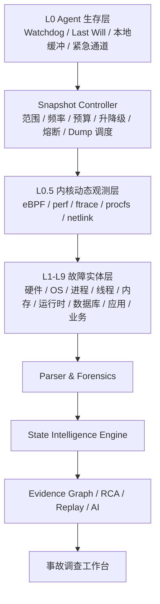

# DBSleuth eBPF 内核动态观测设计

| 属性 | 内容 |
|---|---|
| 版本 | v0.1 Draft |
| 状态 | 生产架构基线，待实现与兼容性验证 |
| 适用范围 | Linux、容器与 Kubernetes；Windows 使用等价内核观测能力 |

## 1. 定位

eBPF 在 DBSleuth 中不是 Linux Agent 的一个普通采集器，而是位于 Agent 生存层之上、故障实体层之下的 **L0.5 内核动态观测层**。它用于记录传统秒级轮询看不到的毫秒级状态变化：

- 线程被唤醒后等待多久才获得 CPU；
- 线程为何离开 CPU，正在等待 IO、网络、锁还是系统调用；
- 哪个进程和线程发出了具体 IO；
- Socket 属于哪个进程、线程、容器和业务链路；
- TCP 重传、连接重置和连接建立延迟发生在哪里；
- 缺页、内存回收、分配失败和 OOM 前如何演化；
- 故障前几十毫秒到数秒内，内核状态如何变化。

```text
内核事件
  -> eBPF 内核侧过滤与聚合
  -> 标准化内核事件
  -> 状态识别与状态转换
  -> 目标线程、进程、设备或 Socket
  -> 增量 Snapshot 与 Dump
  -> Evidence Graph
  -> RCA 与事故回放
```

## 2. 架构位置



eBPF 横向提供主机、进程、线程、内存、网络、存储、容器和 Native Runtime 的关联锚点，但不替代上层专用采集器。

## 3. 职责边界

### eBPF 负责

1. 捕获和聚合内核事件；
2. 建立 PID/TID、cgroup、Namespace、Socket、设备和 Trace 的关联锚点；
3. 识别高频、短时状态变化；
4. 确定需要深度采集的目标对象；
5. 触发线程、进程、运行时或数据库 Snapshot；
6. 记录采集完整度、序列缺口和自身开销。

### eBPF 不负责

- Process/Core/Kernel Dump；
- Java HPROF、JFR 或 .NET Heap Dump；
- Oracle Systemstate、AWR/ASH 或 SQL Server Dump；
- 完整业务语义和托管运行时对象解释；
- 原始证据的长期存储；
- 单独给出根因结论。

正确关系是：

```text
eBPF = 内核事件雷达
Snapshot / Dump = 事故现场保存
Parser = 结构化取证
State Engine = 行为归纳
Evidence Graph = 跨层关系证明
```

## 4. Linux 传感器

### 4.1 调度与线程

优先观察 `sched_wakeup`、`sched_wakeup_new`、`sched_switch` 和线程生命周期事件，计算：

- Run Queue 延迟、On-CPU 与 Off-CPU 时间；
- 调度抖动、上下文切换和 CPU 迁移；
- 抢占、阻塞、退出等状态变化；
- 内核栈和用户栈指纹。

输出以聚合和状态为主，不长期保存每一次调度事件：

```json
{
  "entity_id": "thread:8821",
  "run_queue_delay_ms": 350,
  "off_cpu_reason": "block_io",
  "state_code": 3030,
  "reason_code": "EBPF_BLOCK_IO_WAIT",
  "evidence_ref": "EV-20260812-00928"
}
```

### 4.2 进程生命周期

采集 fork、exec、exit、父子关系、退出码、异常信号、可执行文件 Build ID、cgroup、容器和 Namespace，用于识别进程频繁重启、异常退出、二进制替换和异常模块运行。

### 4.3 Block IO 与文件系统

关联 IO 提交与完成时间、读写类型、请求大小、设备 major/minor、队列时间、服务时间、错误码、PID/TID 和 cgroup。分析必须区分：

```text
总延迟 = 队列等待 + 设备服务时间
```

这样才能判断是系统队列堆积、单设备热点、设备本身变慢，还是 IO 错误重试。

### 4.4 TCP、Socket 与网络

观察 connect、accept、close、TCP 状态、重传、Reset、丢包和 Socket 生命周期。使用 Socket Cookie、五元组、PID/TID、cgroup 和网络 Namespace 建立：

```text
应用线程 -> Socket -> 目标端点 -> 数据库连接 -> 数据库会话
```

### 4.5 内存压力

观察缺页、后台/直接回收、压缩、页面迁移、分配失败、OOM 选择和 OOM Kill。eBPF 负责发现演化过程，Snapshot Controller 决定是否采集内存映射、对象直方图、线程栈或受审批的 Heap/Core Dump。

### 4.6 Futex、锁与等待链

记录 Futex 等待与唤醒、锁竞争、等待时间、持有者和等待者，构造：

```text
Thread A -> waits_for -> Lock -> held_by -> Thread B -> waits_for -> Block IO
```

表面锁等待可能只是结果，真正根因可能是持锁线程正在等待存储或网络。

### 4.7 系统调用

系统调用默认只聚合次数、延迟和错误码。进入可疑或故障模式后，才针对指定 PID、cgroup 或调用类型短时采集详细摘要。重点包括 open/read/write/fsync、connect/send/recv、futex、mmap 和 clone/exec。

完整路径、连接串、Token、SQL 参数和业务内容必须在 Agent 端过滤或脱敏。

### 4.8 uprobe、uretprobe 与 USDT

用于关联数据库客户端库、连接池、Native Runtime 和业务框架。探针必须按 Build ID、库版本、符号版本和探针模板版本选择，禁止依赖未经验证的固定地址。

Java、.NET 等托管运行时仍由 JFR、JVM TI、EventPipe 等适配器提供语义，再通过 PID/TID、时间和 Trace/Span 与 eBPF 事件合并。

## 5. 统一内核事件协议

每条标准化事件至少包含：

| 字段 | 用途 |
|---|---|
| `schema_version/event_type/event_version` | 协议演进与兼容 |
| `host_id/boot_id/sensor_id/program_version` | 来源和程序身份 |
| `monotonic_ns/wall_clock_ns/sequence/cpu` | 顺序、时钟对齐与缺口识别 |
| `pid/tgid/tid/process_start_ns` | 进程线程身份与 PID 重用防护 |
| `cgroup_id/mount_ns/network_ns` | 容器和 Namespace 关联 |
| `socket_cookie/src/dst/protocol` | 网络链路关联 |
| `device_major/device_minor/inode` | 存储与文件对象关联 |
| `trace_id/span_id` | 应用调用链关联 |
| `capture_status/dropped_before` | 数据质量与丢失语义 |

关键组合：

- `boot_id + pid + process_start_ns` 防止 PID 重用导致错误关联；
- `socket_cookie + 五元组` 连接线程、进程和数据库连接；
- `cgroup_id + namespace` 连接容器、Pod 与主机；
- `monotonic_ns + wall_clock_ns` 防止 NTP 跳变破坏事故顺序。

## 6. E0-E4 采集状态机

| 等级 | 模式 | 采集策略 |
|---|---|---|
| E0 | 常态 | 内核侧聚合、生命周期、低频调度、IO/TCP 分布和 P0 错误 |
| E1 | 可疑 | 限定 PID/cgroup/device/port，提高到秒级并开启 Off-CPU/IO 跟踪 |
| E2 | 故障 | 目标线程栈、等待链、系统调用延迟和详细 Socket 关联 |
| E3 | 取证 | 冻结内核窗口，确定目标并编排 Thread/Core/Heap/DB Dump |
| E4 | 灾难 | 仅保留 OOM、Oops 前兆、退出、设备错误、网络变化和 Last Will |

升级由确定性规则、复合状态或人工操作触发；降级由 TTL、恢复条件、资源预算或 Kill Switch 触发。禁止在全机范围长期运行 E2/E3。

## 7. 资源保护与熔断

每个探针必须声明：

- 每秒最大事件数和每实体最大事件数；
- Ring Buffer 高水位和消费者延迟上限；
- 栈采样时长、采样比例、Map 大小与内存预算；
- 目标 PID/cgroup/device/port；
- 租约开始时间、TTL、到期动作和 Kill Switch。

过载时按以下顺序降级：

```text
详细事件 -> 采样事件 -> 仅聚合 -> 仅 P0 错误事件 -> 卸载非关键探针
```

Ring Buffer 空间不足时必须显式报告：

```json
{
  "status": "PARTIAL",
  "reason": "EBPF_RINGBUF_OVERFLOW",
  "submitted_events": 980000,
  "consumed_events": 961766,
  "lost_events": 18234,
  "last_sequence": 8829102
}
```

“没有收到事件”不能解释为“没有异常”。Snapshot 和报告必须展示丢失数量、时间段和受影响传感器。

## 8. 安全模型

Agent 拆分为普通采集进程和最小化 eBPF 特权加载器。加载器只负责能力探测、签名与哈希校验、Verifier 加载、Attach/Detach、Map 生命周期、租约和状态上报。

生产环境只允许加载：

- DBSleuth 发布并签名的 BPF 对象；
- 已审核的 Program ID、固定版本和固定哈希；
- 固定 Map 上限和 Attach Point 白名单；
- 带目标范围、资源预算、审批和 TTL 的探针任务。

禁止上传或动态编译任意 BPF 源码，禁止用 uprobe 实现无边界变量读取。Verifier 是内核安全防线之一，不能替代产品侧权限、限流、隐私和逻辑审计。

## 9. 兼容与回退

Agent 启动时执行 Capability Probe：内核版本、BTF、Program/Map/Helper/Attach Type、JIT、权限和安全策略。

```text
libbpf CO-RE + BTF
  -> 不支持：发行版兼容探针包
  -> 不支持：tracefs / perf / ftrace / procfs / netlink
  -> 不支持：传统 Agent 指标与事件采集
```

DBSleuth 维护 Kernel Capability Matrix，记录发行版、内核、BTF、探针版本、支持传感器、已知问题、回退模式和验证结果。任何 eBPF 加载失败都不能阻止基础 Agent 启动。

## 10. Windows 策略

Windows 不照搬 Linux eBPF 路径。生产主路径使用 ETW、WCT、WFP、Performance Counter 和 Debugger/Dump 能力；eBPF for Windows 仅在经过独立兼容性、安全与签名验证后作为可选扩展。

| 平台 | 生产主路径 | 定位 |
|---|---|---|
| Linux | eBPF + libbpf CO-RE | 核心内核观测能力 |
| 容器/Kubernetes | eBPF + cgroup/Namespace | 核心关联能力 |
| 不支持 eBPF 的 Linux | perf/ftrace/procfs/netlink | 自动降级 |
| Windows | ETW/WCT/WFP/Performance Counter | 等价生产主路径 |

跨平台输出使用相同的 Kernel Event 和 Evidence Schema，上层状态机与证据图不依赖具体采集技术。

## 11. 栈与符号解析

```text
Stack ID -> 内核/用户地址 -> Build ID -> 离线符号仓库
         -> 函数、模块、偏移 -> 结构化调用链
```

符号仓库计划保存 Kernel BTF、vmlinux、发行版 debuginfo、应用 ELF、共享库符号和 Build ID 索引。符号解析状态必须标记为 `COMPLETE`、`PARTIAL`、`MISSING` 或 `MISMATCH`，不能用错误符号生成确定性结论。

## 12. 与状态机和 Snapshot 联动

eBPF 原始事件先在内核侧聚合，再转换为标准事件和状态：

```text
7030 存储 IO 异常（原因：Block IO 队列等待超标）
  -> 3030 线程进入 IO 等待
  -> 5020 数据库日志等待
  -> 8040 应用请求超时
  -> 9001 重大故障
```

长期保存状态与转换；事故窗口保存必要 eBPF 事件和聚合；Thread/Core/Heap/Database Dump 按策略、审批和保留期限保存。触发链必须记录规则、目标、预算、采集结果和证据引用。

## 13. 开发任务

| ID | 优先级 | 任务 |
|---|---|---|
| `EBPF-050` | P0 | 内核、BTF、Program/Map/Helper、权限和回退能力探测器 |
| `EBPF-051` | P0 | 签名对象、租约、预算、Attach/Detach 和 Kill Switch 特权加载器 |
| `EBPF-052` | P0 | 统一 Kernel Event Header、序列、时钟与关联锚点协议 |
| `EBPF-053` | P0 | Map、Ring Buffer、事件速率、丢失和消费者延迟自监控 |
| `EBPF-060` | P1 | 调度、Run Queue、On/Off-CPU 与线程生命周期传感器 |
| `EBPF-061` | P1 | Block IO 队列、服务时间、错误和设备关联传感器 |
| `EBPF-062` | P1 | TCP 状态、重传、Reset、Socket Cookie 与进程关联传感器 |
| `EBPF-063` | P1 | 缺页、回收、分配失败、OOM 与 OOM Kill 传感器 |
| `EBPF-064` | P1 | Fork/Exec/Exit、Build ID、cgroup 与 Namespace 传感器 |
| `EBPF-070` | P2 | Futex、锁竞争与等待链传感器 |
| `EBPF-071` | P2 | 限定目标的系统调用延迟传感器 |
| `EBPF-072` | P2 | 按 Build ID 和模板版本管理的 uprobe/USDT 框架 |
| `EBPF-073` | P2 | 离线符号仓库与解析服务 |
| `EBPF-074` | P2 | eBPF 标准事件到状态和转换的映射器 |
| `EBPF-075` | P2 | eBPF 异常到线程、进程、Heap 和数据库 Dump 的编排 |

## 14. 生产验收

| 验收项 | 标准 |
|---|---|
| 能力探测 | 不支持时自动降级，不影响基础 Agent 启动 |
| 资源控制 | 所有探针都有目标、预算、TTL 和 Kill Switch |
| 完整性 | 报告序列缺口、Ring Buffer 溢出和消费者延迟 |
| 关联 | 事件至少包含 Host、Boot、PID/TID 和双时钟锚点 |
| 安全 | 只加载签名白名单对象，不执行任意 BPF 源码 |
| 兼容 | 建立发行版、内核、BTF 和探针版本矩阵 |
| 状态 | 原始事件可确定性映射到状态、原因和证据 |
| 快照 | 异常可精确触发目标线程、进程或 Dump 采集 |
| 离线 | 栈与符号解析不依赖公网 |
| 自观测 | 可查看探针负载、Map、事件速率、丢失和健康状态 |
| 回放 | 内核状态变化进入事故时间线和 Snapshot Diff |

## 15. 参考资料

- [Linux kernel: libbpf program types](https://docs.kernel.org/bpf/libbpf/program_types.html)
- [Linux kernel: BPF ring buffer](https://docs.kernel.org/bpf/ringbuf.html)
- [Linux kernel: eBPF verifier](https://docs.kernel.org/bpf/verifier.html)
- [Linux kernel: BPF design Q&A](https://docs.kernel.org/bpf/bpf_design_QA.html)

eBPF 的价值不是采集更多数据，而是在内核状态开始变化的第一刻，留下系统如何一步步走向故障的可验证过程。
